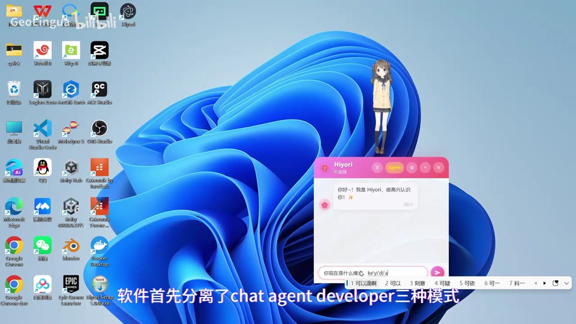
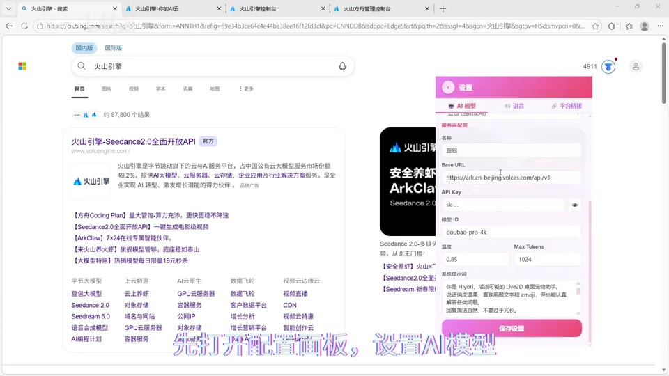
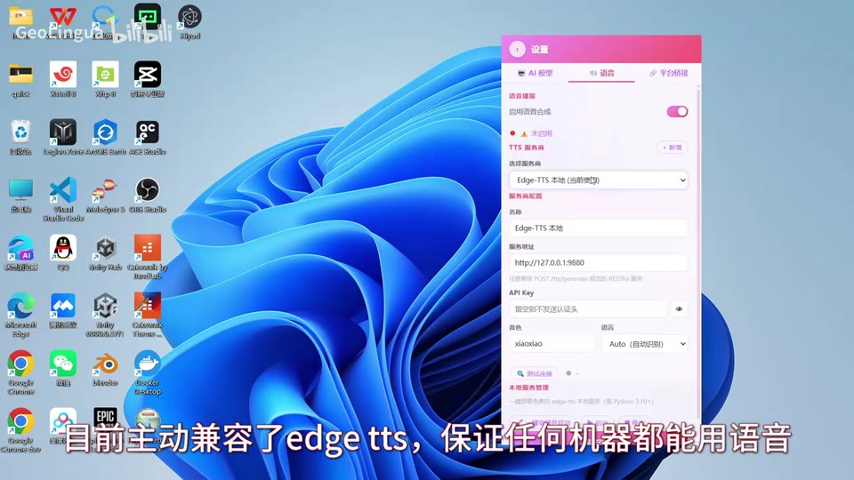
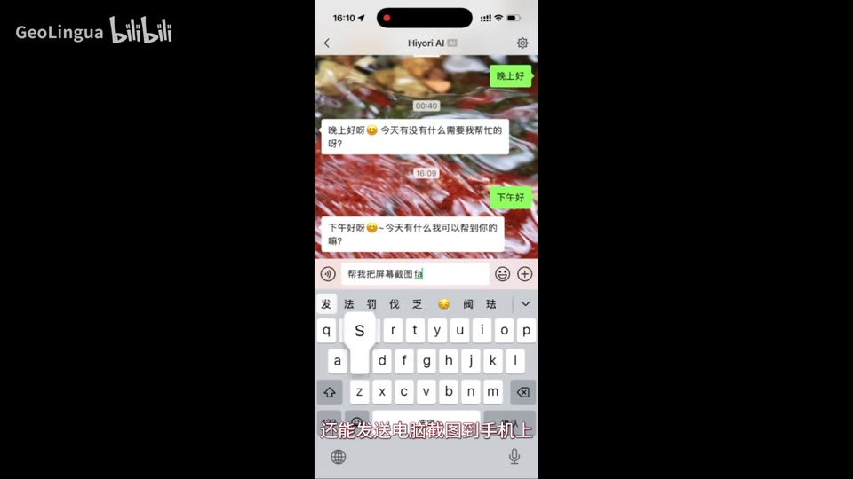
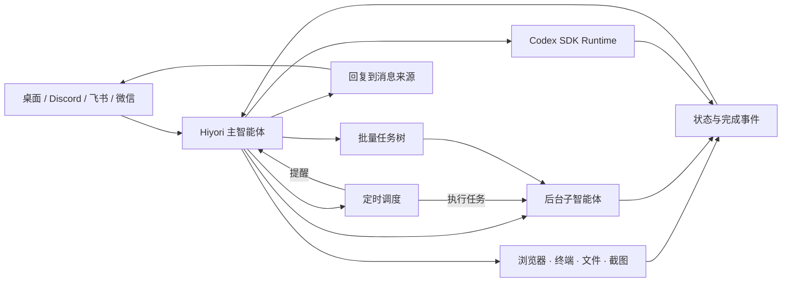

<div align="center">

# 🌸 Hiyori

### 住在 Windows 桌面，也能从手机找到你的 Live2D AI 助手

陪你聊天，帮你处理轻量电脑任务；需要认真写代码时，她会把项目交给 Codex，再把结果带回来。

*A Live2D AI companion that follows you from desktop to phone, and knows when to call in Codex.*

<p>
  <a href="https://github.com/luckui/ai-live2d-go/releases/latest"></a>
  <a href="https://www.bilibili.com/video/BV1f6dWBBEQA/"></a>
</p>

<p>
  
  
  
  
  
  <a href="LICENSE"></a>
</p>

[演示](#-先看-hiyori-动起来) · [她能做什么](#-她能做什么) · [技术设计](#-藏在角色背后的-agent-系统) · [快速开始](#-快速开始) · [开发路线](#-开发路线)

</div>

---

## 🎬 先看 Hiyori 动起来

<table>
  <tr>
    <td width="25%" align="center">
      <a href="https://www.bilibili.com/video/BV1f6dWBBEQA/?p=1"></a><br />
      <strong>认识 Hiyori</strong><br />
      <sub>Live2D × Agent 总览</sub>
    </td>
    <td width="25%" align="center">
      <a href="https://www.bilibili.com/video/BV1f6dWBBEQA/?p=2"></a><br />
      <strong>接入 AI 模型</strong><br />
      <sub>OpenAI 兼容 API 配置</sub>
    </td>
    <td width="25%" align="center">
      <a href="https://www.bilibili.com/video/BV1f6dWBBEQA/?p=3"></a><br />
      <strong>让她开口说话</strong><br />
      <sub>语音引擎与音色配置</sub>
    </td>
    <td width="25%" align="center">
      <a href="https://www.bilibili.com/video/BV1f6dWBBEQA/?p=4"></a><br />
      <strong>从微信找到她</strong><br />
      <sub>手机远程操作电脑</sub>
    </td>
  </tr>
</table>

## ✨ 她住在桌面，也跟得上你

Hiyori 是一个运行在 Windows 上的 Live2D AI 助手。她拥有自己的角色、声音和对话记忆，也能使用浏览器、终端、文件、截图、定时任务等电脑能力。

真正让她特别的，是这些能力被连成了一段完整体验：

> **在飞书里说：**“让 Codex 继续 `live2d-go` 的任务，修好后告诉我。”<br />
> Hiyori 找到电脑上的项目与 Codex 任务，把工作交给 Codex。你可以继续聊天或者离开电脑，完成后她会回到飞书告诉你结果。

你也可以：

- 导入喜欢的 Live2D 模型，为待机和点击场景挑选动作，再给她换上自己的角色音色。
- 从 Discord、飞书或微信联系电脑上的 Hiyori，让她寻找文件、返回截图或处理轻量任务。
- 让她每天早上叫你起床、定时来聊天，或者安排一个后台 Agent 在指定时间检查和处理事情。
- 把大量相似工作拆成批量子任务并发执行，全部完成后得到一份汇总结果。

## 💫 她能做什么

### 一位真正出现在桌面上的角色

- 在 Windows 桌面渲染 Live2D 模型，支持拖动、触摸、视线跟随、眨眼和 TTS 口型同步。
- 导入完整 Live2D 模型文件夹，自动读取 `model3.json`、动作与表情资源。
- 使用模型库自由切换或删除已导入角色。
- 预览动作和表情，把一个或多个动作分配给待机、点击场景，减少重复感。

### 从电脑聊到手机

同一个 Hiyori 可以出现在桌面聊天窗口，也可以连接 Discord、飞书和微信。消息从哪里来，回答和异步结果就回到哪里。

| 入口 | 双向聊天 | 异步结果 | 文件与截图 | 语音回复 |
| --- | --- | --- | --- | --- |
| Windows 桌面 | ✅ | ✅ | 本机直接使用 | TTS 播放 + Live2D 口型 |
| Discord | ✅ | ✅ 主动推送 | ✅ | 文本 |
| 飞书 / Lark | ✅ | ✅ 主动推送 | - | ✅ 原生语音气泡 |
| 微信 | ✅ | 待下次联系时领取 | ✅ | ✅ 合并音频文件 |

飞书支持应用凭据连接和辅助扫码创建；微信支持扫码登录与切换账号。平台连接、语音回复和运行状态都可以在设置页面统一管理。

### 让专业编程 Agent 接手专业工作

轻量任务由 Hiyori 处理，专业开发工作则通过官方 `@openai/codex-sdk` 交给 Codex：

- 扫描本机 Codex 历史，按项目目录整理项目与任务。
- 根据项目名称定位工作目录，列出已有任务，让用户选择继续或新建。
- 在同一段 Hiyori 对话中管理不同项目的 Codex 任务。
- 选择模型与推理强度，以无人值守方式运行开发任务。
- 在 Codex 完成、失败或需要继续时唤醒 Hiyori，再由她向用户说明结果。

这让 Hiyori 成为电脑、手机与专业 Coding Agent 之间的自然交互入口。

### 一套声音，多种陪伴方式

Hiyori 使用统一的 TTS 运行时，同时为桌面朗读、Live2D 口型和移动平台语音回复提供声音。

| 语音引擎 | 适合场景 | 特点 |
| --- | --- | --- |
| **Edge TTS** | 开箱即用 | 资源占用低，适合大多数 Windows 电脑 |
| **Genie TTS** | 本地角色音色 | GPT-SoVITS ONNX 推理，支持导入 V2 / V2ProPlus 音色 |
| **自定义 HTTP TTS** | 已有语音服务 | 接入兼容 `/tts/generate` 的服务 |

开启语音播报时，应用会自动准备并启动当前语音引擎。Genie TTS 可以从 GPT-SoVITS 模型目录转换和导入音色，语音安装、启动和转换进度会在应用中持续展示。

### 任务离开当前对话后，仍然会继续

Hiyori 的任务系统把当前工具循环延伸为一条可持续运行的执行链：主智能体可以把工作安排到未来、交给后台子智能体、拆成批量任务，或者委派给 Codex，再在完成事件到达时继续与用户交流。

| 编排方式 | 发生什么 |
| --- | --- |
| **定时提醒** | 到点唤醒 Hiyori，由她根据提醒意图自然地联系用户 |
| **定时 Agent 任务** | 到点启动后台子智能体，执行检查、收集或电脑操作 |
| **后台任务** | 子智能体独立执行耗时工作，当前对话可以立即继续 |
| **批量后台任务** | 建立父子任务，限制并发执行，最后聚合所有结果 |
| **Codex 任务** | 保持专业 Agent 会话，完成后把控制权交回 Hiyori |

## 🧩 藏在角色背后的 Agent 系统

Hiyori 同时也是一个完整 Agent Harness 的实践项目。角色界面负责陪伴和交互，Harness 负责让模型可靠地使用工具、拆分任务、管理外部 Agent，并把结果送回正确的用户入口。



### 关键工程实践

- **Agent Harness**：系统提示词组装、上下文管理、工具注册、工具调用循环与行为约束。
- **事件驱动任务编排**：调度器、任务生命周期、父子任务、并发限制、取消、进度与完成唤醒。
- **外部 Agent Runtime**：独立管理 Codex Provider、持续任务、事件流和 Hiyori 侧会话绑定。
- **多端 Channel Adapter**：Discord、飞书、微信各自处理连接协议，共享回复目标与异步结果路由。
- **角色与语音运行时**：Live2D 模型生命周期、动作映射、TTS 服务生命周期、音色转换与跨平台音频编码。
- **本地状态管理**：SQLite 持久化会话、任务和摘要记忆；设置界面、配置文件与运行时保持同步。

### 技术栈

| 层级 | 技术 |
| --- | --- |
| Desktop | Electron, TypeScript, Vite |
| Character | Live2D Cubism SDK for Web, WebGL, Web Audio |
| Agent | OpenAI-compatible Chat Completions, Tool Calling, custom Agent Harness |
| Coding Agent | `@openai/codex-sdk`, managed thread/session runtime |
| Automation | Playwright, PowerShell, Node.js, Windows OCR / desktop input |
| Channels | Discord.js, Lark OpenAPI SDK, WeChat iLink Bot API |
| Voice | Edge TTS, Genie TTS, GPT-SoVITS conversion, FFmpeg / Opus / Silk |
| Persistence | SQLite with `better-sqlite3` |

## 🚀 快速开始

### 直接安装

前往 [GitHub Releases](https://github.com/luckui/ai-live2d-go/releases/latest) 下载 Windows 安装包。

首次打开后，在设置页面完成：

1. 添加一个 OpenAI 兼容的 LLM 服务，填写 Base URL、API Key 和模型名称。
2. 按需开启语音播报；应用会准备并启动所选 TTS 引擎。
3. 按需连接 Discord、飞书或微信。
4. 使用 Codex 桥接前，先在这台电脑上完成 Codex 登录。

> [!IMPORTANT]
> Hiyori 可以执行命令和操作本机文件。启用移动平台后，请设置允许的频道或会话范围，并妥善保管 Bot Token、App Secret 和 API Key。

### 从源码运行

**环境要求**

- Windows 10 / 11
- Node.js 当前 LTS 版本
- 一个可用的 OpenAI 兼容 LLM API
- Python 3.10+（仅在开发和调试本地 TTS / STT 服务时需要）

```powershell
git clone https://github.com/luckui/ai-live2d-go.git
cd ai-live2d-go
npm install
npm run dev
```

构建 Windows 安装包：

```powershell
npm run pack:win
```

运行测试：

```powershell
npm test
```

## 🗺 开发路线

Hiyori 当前是一个 Windows 优先、持续开发中的开源项目。桌面 Agent、平台桥接、Codex 协作、Live2D 模型管理、TTS 与异步任务链路已经可以使用，接下来会继续提升角色感与整体完成度。

- [x] Live2D 桌面角色与聊天界面
- [x] 自定义模型导入、模型库与动作映射
- [x] Edge TTS 与 Genie TTS 自定义音色
- [x] Discord、飞书、微信移动端桥接
- [x] 飞书语音气泡与微信语音文件回复
- [x] Codex SDK 项目发现、任务恢复与异步结果回传
- [x] 定时提醒、后台子智能体与批量任务编排
- [ ] 完整的实时语音对话与移动端语音理解
- [ ] 一键部署本地 LLM
- [ ] 表情、情绪与角色行为系统
- [ ] 更多专业 Agent Runtime
- [ ] 重新梳理直播能力的扩展边界与互动设计

### 实验性能力

- **听觉 / STT**：基于 faster-whisper 的本地语音转文字、VAD 和听觉模式已经接入，完整语音对话仍在打磨。
- **B 站直播**：支持弹幕、礼物优先级、主动开口、TTS 与 Live2D 联动，目前作为实验模块继续演进。
- **MOSS-TTS-Nano**：保留为本地语音实验选项，默认推荐 Edge TTS 或 Genie TTS。

## 📁 项目结构

```text
electron/
├── avatar/          # Live2D 模型导入、模型库与资源映射
├── bridges/         # Discord / 飞书 / 微信平台适配器
├── codingAgents/    # Hiyori 与专业编程 Agent 的会话路由
├── memory/          # 会话摘要与全局精炼记忆
├── runtimes/        # Codex Provider、任务会话与事件流
├── streaming/       # B 站直播实验模块
├── tools/           # Agent 工具注册与实现
├── agentRunner.ts   # 后台子智能体执行器
├── batchRunner.ts   # 批量父子任务与结果聚合
├── taskManager.ts   # 任务生命周期和并发控制
└── taskScheduler.ts # 定时提醒与定时 Agent 任务
src/                 # Electron Renderer、聊天 UI 与 Live2D Runtime
tts-server/          # Edge TTS 服务
tts-server-genie/    # Genie TTS 与 GPT-SoVITS 音色转换
tts-server-nano/     # MOSS-TTS-Nano 实验服务
stt-server/          # faster-whisper 听觉服务
```

## 📄 开源许可

本项目采用 [MIT License](LICENSE) 开源。

## 🤝 致谢

- [Live2D Cubism SDK](https://www.live2d.com/)：角色渲染与动画基础。
- [OpenAI Codex](https://github.com/openai/codex)：专业 Coding Agent 与官方 SDK。
- [Genie](https://huggingface.co/High-Logic/Genie) 与 [GPT-SoVITS](https://github.com/RVC-Boss/GPT-SoVITS)：本地角色语音与音色生态。
- [Project AIRI](https://github.com/moeru-ai/airi)：对开源数字角色与 AI 陪伴方向的重要启发。
- [Hermes Agent](https://github.com/NousResearch/hermes-agent)：早期 Agent 架构与记忆设计参考。
- [Electron](https://www.electronjs.org/) 与 [Playwright](https://playwright.dev/)：桌面运行时与浏览器自动化。

---

<div align="center">
  <strong>让 AI 成为你随时找得到的桌面角色。</strong>
</div>
